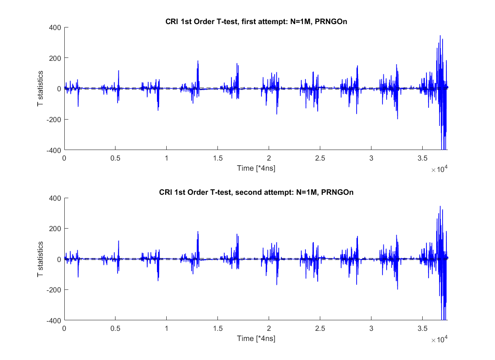

# Masked AES implementations from Virginia Tech
This is a forked version of Virginia Tech's 1st order protected masked AES implementation. More specifically, this repository includes two masked AES implementation: a byte-wise table-based masked AES \("Byte-Masked-AES"\) and a bit-sliced masked AES implementation \("bitsliced-masked-aes"\). The purpose of this fork is to adapt the implementation to [Dr. Daniel Page's SCALE](https://github.com/danpage/scale-hw) project, so  we can perform some security evaluation on our off-the-shelf ARM Cortex M0/M3 platforms.

## Byte-Masked-AES
### Scheme
The byte-wise implementation follows a well-known textbook example scheme, whose details can be found in the [scheme introduction](Byte-Masked-AES/Scheme_Introduction.md).

### Scheme Adaption 
All the code changes during the adaption procedure are documented in the [Revision Notes] (Byte-Masked-AES/Revision_Notes.md)
 
### Security Evaluation
We have performed 1st order standard CRI TVLA test with 1 million traces on an NXP LPC1114 \(Cortex M0\) core. 

 
Note that according to [the CRI's standard](https://csrc.nist.gov/csrc/media/events/non-invasive-attack-testing-workshop/documents/08_goodwill.pdf), only the same leakage samples show up in both attempts as "leaky" with the same polarity will be counted as leakage.

Corresponding experiment setups can be found in [Setup.md](Byte-Masked-AES/TVLA-Test/Setup.md) .

Attention: interpreting TVLA results might be quite tricky. We strongly recommend readers to read our [Caution Notes](Byte-Masked-AES/TVLA Test/Caution-Notes.md)

## bitsliced-masked-aes