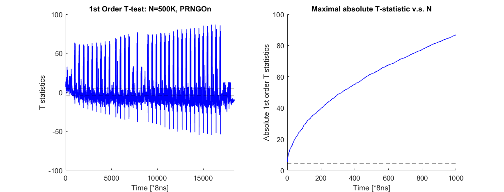

# Masked AES implementations from Virginia Tech
This is a forked version of Virginia Tech's 1st order protected masked AES implementation. More specifically, this repository includes two masked AES implementations: a byte-wise table-based masked AES \("Byte-Masked-AES"\) and a bit-sliced masked AES implementation \("bitsliced-masked-aes"\). The purpose of this fork is to adapt the implementation to [Dr. Daniel Page's SCALE](https://github.com/danpage/scale-hw) project, so  we can perform some security evaluations on our off-the-shelf ARM Cortex M0/M3 platforms.

## Byte-Masked-AES
### Scheme
The byte-wise implementation follows a well-known textbook example scheme. Details of this scheme can be found in the [scheme introduction](Byte-Masked-AES/Scheme_Introduction.md).

### Code Adaption 
All the code changes during the adaption procedure are documented in the [Revision Notes](Byte-Masked-AES/Revision_Notes.md)
 
### Security Evaluation
We have performed 1st order standard CRI TVLA test with 1 million traces on an NXP LPC1114 \(Cortex M0\) core. 

 

Note that according to [the CRI's standard](https://csrc.nist.gov/csrc/media/events/non-invasive-attack-testing-workshop/documents/08_goodwill.pdf), only the same leakage samples show up in both attempts as "leaky" with the same polarity will be counted as leakage.

Corresponding experiment setups can be found in [Setup.md](Byte-Masked-AES/TVLA-Test/Setup.md) .

Attention: interpreting TVLA results might be tricky. We strongly recommend interested readers to read our [Caution Notes](Byte-Masked-AES/TVLA-Test/Caution-Notes.md)

## bitsliced-masked-aes
### Scheme
The bitsliced implementation "slices" all the same bits from many concurrent plaintext blocks. For a 32-bit processor, this implementation uses 128 32-bit words as its input state, whereas each word represents 1 specific bit of all 32 words. 

The masking part uses a (slightly-modified) 2-share ISW scheme, which represents each intermediate state bit as 2 bit shares. This specific implementation stores both shares in the adjacent positions within one register (a technique which we called "share-slicing"). As a consequence, for the protected version, only 16 concurrent blocks are required to achieve best performance.

The authors had provided [a README file](bitsliced-masked-aes/README.md), briefly explained this implementation as well as the footprint/efficiency on PC. We have also provided a probably more detailed [scheme introduction](bitsliced-masked-aes/Scheme_Introduction.md), further explains facts that may or may not affect its security in practice.

### Code Adaption 
All the code changes during the adaption procedure are documented in the [Revision Notes](bitsliced-masked-aes/Revision_Notes.md)

### Security Evaluation
We have performed 1st order TVLA test with 500K traces on an NXP LPC1114 \(Cortex M0\) core. As the overall encryption takes quite long to proceed, we have only tested the first Sbox computation within the first round. 

 

Readers may notice that there are 34 "peaks" on this trace: it is very likely these correspond to the [34 AND2 "gates"](bitsliced-masked-aes/bs.c) within the Sbox. You might notice that two AND2 have smaller peaks (around 7300 and 8300): these two should correspond to M32 and M35, which get one of the inputs from the previous AND2 gates. As the probability of these inputs equal to 1 is lower than normal input bits (around 25\% v.s. 50\%), it seems the T statistics also reflect this phenomenon. Bear in mind that this is just my personal conjecture; I did NOT validate the sources of these leakages.  

Corresponding experiment setups can be found in [Setup.md](bitsliced-masked-aes/TVLA-Test/Setup.md)

Attention: interpreting TVLA results might be tricky. We strongly recommend interested readers to read our [Caution Notes](bitsliced-masked-aes/TVLA-Test/Caution-Notes.md)

